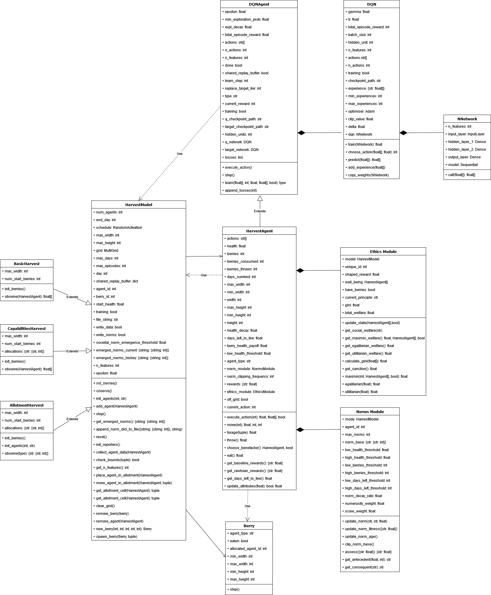

# PriNE
Principles for (ethical) norm emergence using reinforcement learning in multi-agent systems

Create virtual environment using: 

`conda env create -f environment.yml`

To run:

`run.py [train] [test] [generate_graphs]`

## UML Diagram

